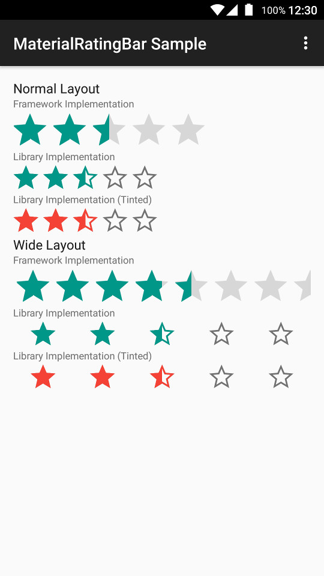
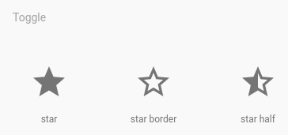
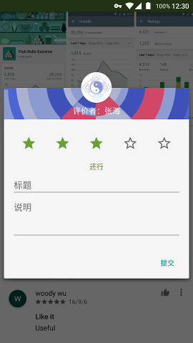
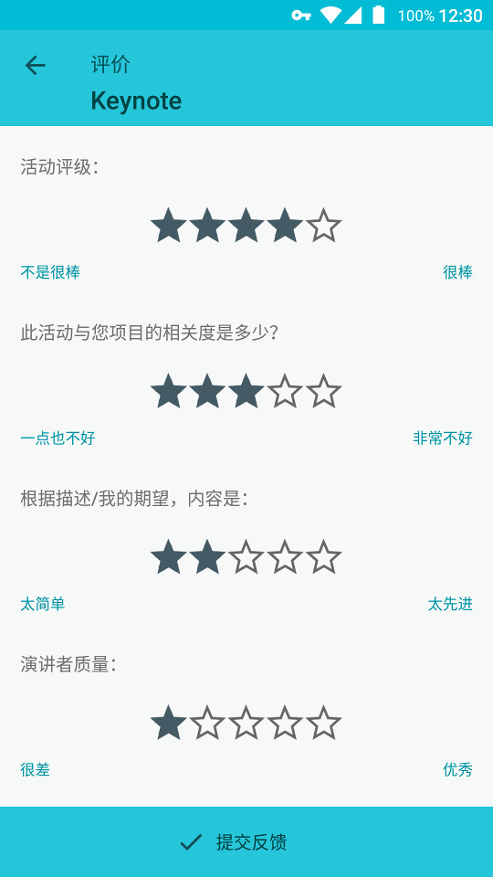

# MaterialRatingBar


Material Design `RatingBar` with consistent appearance on Android 2.3+.

## Why MaterialRatingBar?

- Consistent appearance on Android 2.3+.
- Correct tinting across platforms.
- Get the 2dp star border background as in Material Icons.
- Able to render correctly when `layout_width` is set to `match_parent`, as in Google Play Store.
- Able to scale correctly when `layout_height` is set to values other than 16dp, 36dp and 48dp.
- Used as a drop-in replacement for framework `RatingBar`.

## Preview



[Sample APK](//github.com/DreaminginCodeZH/MaterialRatingBar/releases/download/v1.0.0/sample-release.apk)

## Integration

Gradle:

```gradle
compile 'me.zhanghai.android.materialratingbar:library:1.0.0'
```

## Usage

Simply replace your `RatingBar` with `MaterialRatingBar`, and remember to apply a corresponding style for correct behavior.

For example, to create a normal `MaterialRatingBar`:

```xml
<me.zhanghai.android.materialratingbar.MaterialRatingBar
    android:layout_width="wrap_content"
    android:layout_height="wrap_content"
    style="@style/Widget.MaterialRatingBar.RatingBar" />
```

In order to make your `RatingBar` take the correct and consistent size on all versions, you will always need to use one of the styles from this library. The trick inside it is `android:minHeight` and `android:maxHeight` that controls the drawable height.

You can checkout more style variants are in [styles.xml](library/src/main/res/values/styles.xml)

8 tint-related attributes such as `android:mrb_progressTint` and `app:mrb_progressTintMode` are also supported so that they can control the tinting of rating drawables. The default tint color is `?colorControlActivated`, and the default tint mode is `src_in`.

For a detailed example, you can refer to the [sample app's layout](//github.com/DreaminginCodeZH/MaterialRatingBar/blob/master/sample/src/main/res/layout/main_activity.xml), there you can find examples such as tinting and wide layout.

## Design

Filled star or star border:

The framework's `RatingBar` uses filling stars with grey color as track, however as per the Material Icons site, star border icons are given.



And as for the Google Play Store and Google I/O app, they are both using the star borders as track.

 

Star size:

Google Play Store has stars of optical size 24dp, while Google I/O app and framework `Widget.Material.RatingBar.Indicator` have stars of size 36dp (which are of optical size 30dp).

Also considering that the Material Icons site gives me 24dp (optical 20dp) and 36dp (optical 30dp), I decided to stick to the 36dp approach which is also visually pleasant.

Wide layout:

Framework `RatingBar` gives erroneous rendering for `RatingBar` with `layout_width` set to `match_parent` by tiling the stars without gap. Since Google Play Store employed the wide design, I implemented it inside this library so that `match_parent` will work properly for `MaterialRatingBar`.

Touch tracking:

Google Play Store and Google I/O app both used an implementation other than `RatingBar`, which means dragging on the bar across stars won't work (it is the functionality of `SeekBar`). I think this is a handy way of interaction for users, and it enables the setting of 0 star which can be useful if you want to enable users to reset their rating to unrated.

## License

    Copyright 2016 Zhang Hai

    Licensed under the Apache License, Version 2.0 (the "License");
    you may not use this file except in compliance with the License.
    You may obtain a copy of the License at

       http://www.apache.org/licenses/LICENSE-2.0

    Unless required by applicable law or agreed to in writing, software
    distributed under the License is distributed on an "AS IS" BASIS,
    WITHOUT WARRANTIES OR CONDITIONS OF ANY KIND, either express or implied.
    See the License for the specific language governing permissions and
    limitations under the License.
